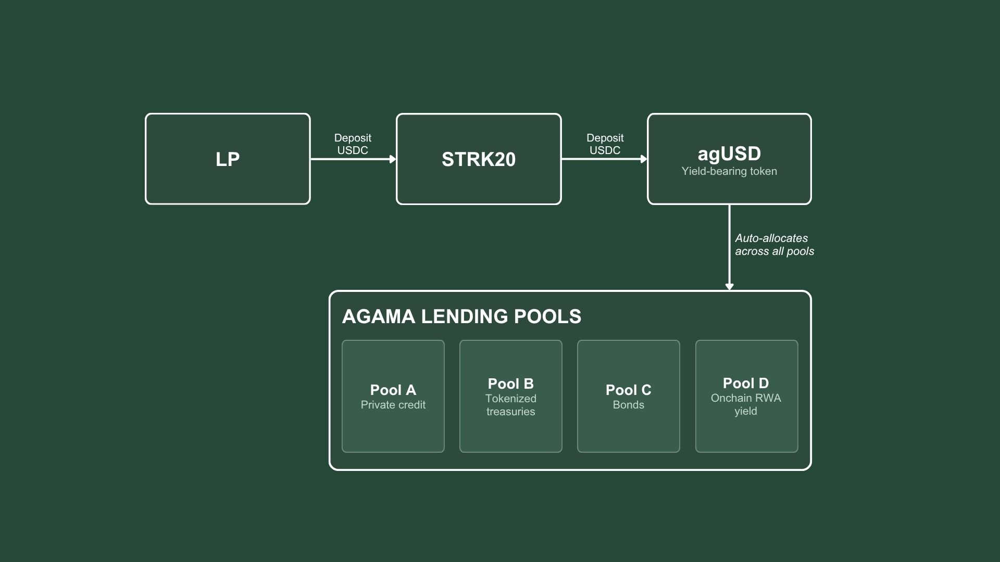

# Agama on Starknet

Cairo implementation of Agama's compliant private-credit lending protocol on Starknet,
built to run on the native **STRK20** privacy layer.

Lenders deposit USDC through Starknet's native **STRK20** privacy layer and receive `agUSD`,
Agama's single **yield-bearing** LP token. The vault reserve is auto-allocated by an on-chain
engine across lending pools — private credit, tokenized treasuries, bonds, on-chain RWA yield —
under concentration caps and marked by a NAV oracle, so the real-world yield accrues to `agUSD`
holders. Redeem `agUSD` at any time to withdraw USDC. Deposits are shielded through Starknet's
native STRK20 pool via the official lending-anonymizer pattern.

Contracts use OpenZeppelin's audited Cairo components and are **immutable** (no upgradeability).
Everything is tested with `snforge` (unit + fork tests) and exercised on Starknet Sepolia.

## Architecture



An LP deposits USDC, shielded through the native STRK20 privacy pool, and mints `agUSD`. Behind
`agUSD` sit the four Agama lending pools — Pool A (private credit, 12%), Pool B (tokenized
treasuries, 5%), Pool C (bonds, 7%), Pool D (on-chain RWA yield, 9%) — each a `LendingPool`
contract that accrues yield on its allocated principal at its own APR, every block. The vault's
**NAV is the sum of every pool's marked value plus the idle reserve**, and the `agUSD` share
price is `NAV / agUSD_supply`. So as the pools earn, the price rises continuously — 1 `agUSD` is
worth strictly more USDC each second, with no manual step. The single token is what LPs hold,
redeem, and earn on; the dApp reads the raw pool state and projects the price live to the
micro-USDC. Concentration caps, the NAV oracle mark, and realized-cash settlement (`distribute`)
back the model on the way to mainnet.

## Contracts (`src/`)

| Contract | Role |
|---|---|
| `agusd.cairo` | `AgamaUSD` — the yield-bearing LP **share token**. OZ ERC20, 6 decimals, mint/burn restricted to the vault (minter), owner-set minter. |
| `vault.cairo` | `AgamaVault` — the yield-bearing core. `deposit` mints `agUSD` shares at the current price; `redeem` burns shares for USDC; `allocate`/`deallocate` deploy the reserve into lending pools; `distribute` adds realized cash yield. **NAV = idle + Σ pool.total_value()**, so the `agUSD` price indexes on the aggregate pools. Donation-attack safe (idle only moves via deposit/redeem/allocate/distribute). |
| `lending_pool.cairo` | `LendingPool` — one Agama lending pool as a yield-bearing NAV position. Allocated `principal` accrues at the pool's `apr_bps` continuously (`total_value = principal + accrued + pending(now)`); Pool A/B/C/D run private-credit / treasuries / bonds / RWA rates. Vault-gated fund/defund, admin-set APR. |
| `nav_oracle.cairo` | `NavOracle` — pushes RWA NAV with three checks (authorized reporter, monotonic timestamp, ≤5% deviation else admin override) and a staleness gate that blocks allocations/withdrawals. |
| `allocation_engine.cairo` | `AllocationEngine` — admin pool registration (no self-listing), per-pool **concentration caps** enforced on-chain, allocations blocked while the oracle is stale. |
| `withdrawal_queue.cairo` | `WithdrawalQueue` — FIFO redemptions settled in order as USDC returns from settlement. |
| `pool_adapter.cairo` | `IPoolAdapter` + `VesuAdapter` (on-chain ERC-4626 / SNIP-22, e.g. Vesu) + `OriginatorAdapter` (off-chain private-credit originator via native USDC + CCTP). |
| `agama_pool_vault.cairo` | `AgamaPoolVault` — an Agama pool as an ERC-4626 / SNIP-22 vault, the interface the STRK20 anonymizer calls. |
| `agama_anonymizer.cairo` | `AgamaLendingAnonymizer` — the official STRK20 lending-anonymizer pattern (`privacy_invoke`): the native privacy pool runs deposit/withdraw on an Agama pool for a shielded user, then pulls the result into an encrypted note. |
| `mock_usdc.cairo` | Minimal ERC20 standing in for native USDC in tests. |

## STRK20 privacy integration

The on-chain integration is the **anonymizer** (`agama_anonymizer.cairo`), a faithful
reproduction of Starknet's official pattern
([`starkware-libs/starknet-privacy`](https://github.com/starkware-libs/starknet-privacy),
`packages/vesu_lending_anonymizer`). It is protocol-agnostic: any ERC-4626 / SNIP-22 vault
plugs in, and `agama_pool_vault.cairo` exposes exactly that interface.

- **Built and tested:** the anonymizer's shielded deposit/withdraw against an Agama pool, at
  the contract level (unit tests + exercised on Sepolia).
- **Fork-ready:** `tests/test_fork.cairo` runs against real Sepolia state (validated today
  against Circle's native USDC). The same harness will test the anonymizer against the
  **deployed STRK20 privacy pool** once the Starknet Foundation shares its Sepolia address.
- **Then, end-to-end private:** client-side ZK proof (Stwo) via the Privacy SDK, with the
  deployed pool invoking the anonymizer through its `INVOKE_SELECTOR`.

## Tests

```bash
snforge test
```

Tests cover: agUSD mint/burn access control, vault deposit/redeem, NAV oracle (three
checks + admin override + staleness), allocation engine (caps + registration + oracle gate),
yield accrual, FIFO withdrawal queue, pool adapters (Vesu + originator), the STRK20 anonymizer
deposit/withdraw, and a Sepolia fork test against real Circle USDC.

## Dev stack

- **scarb** 2.20, **starknet-foundry** 0.62 (`snforge`, `sncast`), **starknet-devnet** 0.9.
- OpenZeppelin Cairo 3.0.
- RPC: `sncast` expects JSON-RPC spec **0.10**. Use **PublicNode**
  (`https://starknet-sepolia-rpc.publicnode.com`) or a dedicated key (Alchemy). Do **not**
  use Blast (decommissioned). Profiles live in `snfoundry.toml`.

```bash
snforge test                                   # unit + fork tests
starknet-devnet --seed 0                        # local node (instant, forkable)
sncast declare --contract-name AgamaVault       # Sepolia (default profile)
```

## Live on Sepolia

The production stack deploys with `scripts/deploy_sepolia.sh` and is exercised end-to-end with
real transactions (see [`docs/e2e-sepolia.md`](docs/e2e-sepolia.md) for tx hashes): the
yield-bearing round-trip (deposit USDC → `distribute` RWA yield → the `agUSD` share price rises
→ redeem returns the appreciated USDC), the NAV oracle push at the deviation cap, and the
withdrawal-queue drain.

| Contract | Address |
|---|---|
| AgamaUSD (agUSD, yield-bearing share) | `0x04c0d175cab9fd3163958443830678c9828f52bbbfcd99c04cc52985302abd1f` |
| AgamaVault | `0x059ed11c2b242e766818f3a957a1a9cfe22b0462b4eb7a60bbb71f5ecdb160b1` |
| LendingPool A (private credit, 12%) | `0x07fd9db4d3377e6909555ea100b631784048de519e0100f32d5877180ebb55ad` |
| LendingPool B (tokenized treasuries, 5%) | `0x018d17c95680bc634ffaa4211be8db4bfec2625ff614a2faf925422c44e3eb2d` |
| LendingPool C (bonds, 7%) | `0x0438cd90d88358b574690ccdd8fd17370245929bed2d390f27bc984cbcf206e6` |
| LendingPool D (onchain RWA yield, 9%) | `0x01ac07c1564032d8c3d02bdff1f9661783f3abc3b97ccdc6de318f70a171249f` |
| NavOracle | `0x0524c9683f467d7c0ddc51b0b83352e33a2300bae006af90d9eb9ecad6349679` |
| WithdrawalQueue | `0x00a8f8cae024f97dd63c5fb90444d49ede807b23b25441d563b77450a8431493` |
| AllocationEngine | `0x013be6562483ab26ea3b1609580b8246eeb3542fbd57c7c583c036a46dc72bb9` |

USDC (Circle native): `0x0512feac6339ff7889822cb5aa2a86c848e9d392bb0e3e237c008674feed8343`.
The full stack is live. Explorer: https://sepolia.voyager.online

## Status

Not live on mainnet. Target: Starknet mainnet in 2–3 months, bringing LPs on-chain into
private-credit pools on the native STRK20 privacy layer. Contracts are immutable; a security
audit is planned before mainnet.
